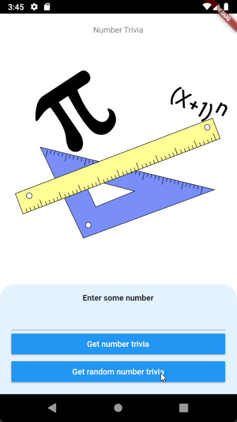

# Number Trivia

Number trivia is an app that get a trivia of a given number.

With this project, I learned about:

- Test driven development and testing in Flutter
- BLoC
- Clean architecture which very similar with Android 😀
- Dependency injection using GetX

Learning materials: https://www.youtube.com/watch?v=dc3B_mMrZ-Q (There are many stuff there that are
outdated, so there would be many workaround)

## Preview

## License

Licensed under [MIT License](LICENSE)
